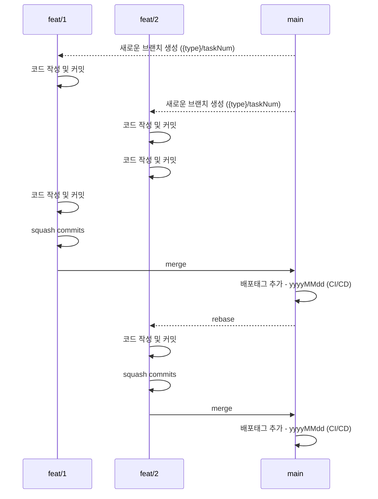

# Doosan-Robotics-Cereal-Number

# Overview

개발팀의 협업 전략을 명시합니다.

## 프로젝트 구조

- **cereal_order_app/**: Flutter 키오스크 애플리케이션
- **vocie_order_bridge/**: ROS2 패키지 (음성 주문 시스템 연동용)
  - ROS2와 Flutter 앱 간의 음성 주문 통신을 담당
  - rosbridge_server를 통해 WebSocket으로 통신
  - 음성 인식 및 GPT 처리 기능 포함
  - **주의**: 이 패키지는 ROS2 workspace(`~/ros2_ws/src/`)에 설치하여 사용

## 최근 업데이트 (음성 주문 정보 UI 추가)

### Flutter 앱 수정 사항

**1. ros2_status_service.dart**
- 주문 정보 수신을 위한 `_orderInfoStreamController` 추가
- ROS2 토픽 `/dsr01/kiosk/order`에서 주문 정보(CSV 형식) 수신
- 수신한 주문 정보를 한글로 변환하여 UI로 전달

**2. voice_order_page.dart**
- 주문 정보 스트림 구독 기능 추가
- 음성 주문 후 주문 내역을 화면에 표시하는 UI 추가
- 메뉴, 양, 컵 정보를 파란색 테두리 박스로 표시

**3. app_config.dart**
- ROS2 WebSocket URL을 로컬 테스트용(`ws://localhost:9090`)으로 변경

### 통신 흐름
```
Flutter → rosbridge → ROS2: 음성 주문 시작 신호 (/dsr01/kiosk/start_voice_order)
ROS2 → rosbridge → Flutter: 주문 정보 전달 (/dsr01/kiosk/order)
Flutter 화면: 주문 내역 표시 (메뉴, 양, 컵)
```

- [브랜치 관리 전략](https://www.notion.so/git-295bd484d24680e9a805d5d89faf7da9?pvs=21)
    - [브랜치 관리 및 커밋 규칙](https://www.notion.so/git-295bd484d24680e9a805d5d89faf7da9?pvs=21)
        - [브랜치 네이밍 포맷](https://www.notion.so/git-295bd484d24680e9a805d5d89faf7da9?pvs=21)
        - [커밋 포맷](https://www.notion.so/git-295bd484d24680e9a805d5d89faf7da9?pvs=21)
    - [배포하기 전에 배포 태그 추가하기](https://www.notion.so/git-295bd484d24680e9a805d5d89faf7da9?pvs=21)

# 브랜치 관리 전략



- 브랜치 관리 전략은 `Github Flow`를 따른다.

## 브랜치 관리 및 커밋 규칙

- `1 Task` = `1 Branch`
- `main` 브랜치는 항상 배포 가능한 상태를 유지한다.
- `main` 브랜치가 변경되면 각각 `작업 브랜치`는 변경사항을 리베이스한다.
- `main` 브랜치에 merge 하기 전에 커밋을 하나로 합쳐야 한다. (squash commits)

### 브랜치 네이밍 포맷

```
type/num
```

- `feat`
- `fix`
- `docs`
- `style`
- `refactor`
- `test`
- `chore`

각자 로컬에서 쉽게 작업 내용을 식별할 수 있는 형태로 브랜치를 생성한다.

### 브랜치 생성 예시

- Task 번호: `CEREAL-1`
- 작업 내용: 주문 기능 구현인 경우 아래와 같은 형태로 자유롭게 브랜치 네이밍

```
feat/1
feat/1_order
feat/1_order_api

```

### 커밋 포맷

```
type : (task) subject

- body
```

커밋 타입은 브랜치 타입과 동일하다.

### 커밋 예시

- Task 번호: `CEREAL-1`
- 작업 내용: 주문 기능 구현

```
feat : (CEREAL-1) 주문 기능 구현

- xxxxx
```

## 배포하기 전에 배포 태그 추가하기

- `main` 브랜치 배포 시 배포 `tag`를 추가한다.
- 배포 태그는 배포 당일 일자로 한다.

### 배포 태그 예시

```
20250808
```
